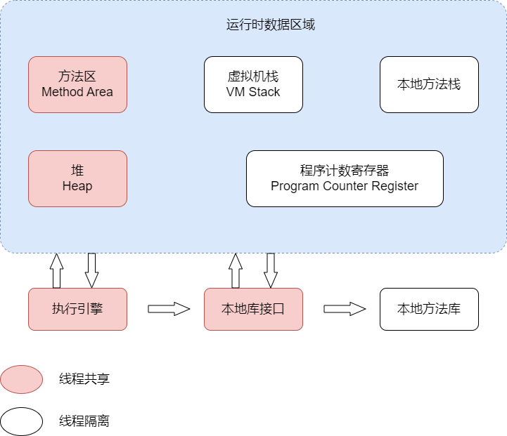
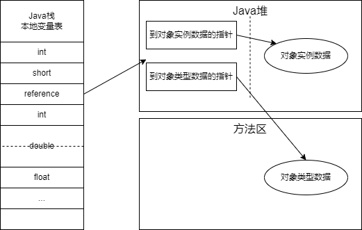
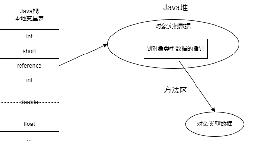

# Java Virtual Machine Tutorial

A brief notes to *`Understanding the JVM Advanced Features And Best Practics, Third Edition,by zhiming zhou(深入理解java虚拟机，第三版，周志明)`*. Thanks to the author and the writings. His professional attitude guide me to step a far travel to java developing.

[toc]

## Part 1. 自动内存管理

### 一. Java内存划分

java内存分区情况如下图：

这是一个门面概念，类似于“抽象类”。它只规定“存在什么行为”，具体的实现依赖实现者。

#### （一）程序计数器

`程序计数寄存器(Program Counter Registry)`所占空间较小，可以理解成“**行号指示器**”。字节码解释器工作室就是通过改变计数器的值来选择下一条执行的字节码指令。通过它可以辅助条件、循环、异常处理、线程恢复等基本逻辑分支完成功能。

对于一个处理器内核来说，同一个时刻只能运行一行指令，多线程是靠“快速”切换时间片达成的。在线程切换时，需要把本次线程运行到的指令行号记录下来，方便下次切换回本线程时，恢复“现场”。因此程序计数器必须是`线程私有`的，一个萝卜一个坑。

有一个情况需要说明，如果java方法的一行代码编译后的一条指令（一行java代码可能编译出多条字节码指令）正在被执行，则计数器内就是字节码指令的地址；如果运行的是本地(native)方法，则这个计数器值应为`未定义(undefined)`。这个内存区域是*`The Java Virtual Machine Specification(java虚拟机规范)`*（后文称为《Java虚拟机规范》或《规范》）中唯一一个没有规定`OutOfMemoryError`的区域。

#### （二）虚拟机栈

`虚拟机栈(Java Virtual Machine Stack)`也是线程私有的，生命周期与线程一致。它描述的是Java方法执行的**线程内存模型**：每个方法被执行的时候，java虚拟机都会同步创建一个`栈帧(Stack Frame)`用于存储**局部变量表**、**操作数栈**、**动态连接**、**方法出口**等信息。

`局部变量表`存放的是编译器已知的各种基本数据类型(boolean, byte, char, short,  int, long, float, double)、对象引用(`reference`类型，相当于一个指针，指向对象起始地址，也可能指向一个代表对象的句柄或其他与此对象有关的位置)和`returnAddress`类型(指向了一条字节码指令的地址)。每种数据类型都会在局部变量表中占用名为`局部变量槽(slot)`的存储空间。其中64位长度的long和double占用两个，其他的均只占用一个。局部变量表所占内存空间的大小在**编译期**确定，在运行期不会发生改变。需要指出，这里所言的“确定”是说变量槽的数量，虚拟机用多少内存（32 bit, 64 bit 还是更多）来实现一个变量槽，由具体实现决定。在`java虚拟机规范`中规定了两种异常：`StackOverflowError`栈深度超过虚拟机允许的上限；`OutOfMemoryError`栈扩展却无法申请到足够的内存。

#### （三）本地方法栈

`本地方法栈(Native Method Stacks)`与虚拟机栈的作用类似，区别是虚拟机栈位虚拟机执行java方法（即字节码）服务，而本地方法栈则是位虚拟机的本地方法服务。

《规范》没有强制规定本地方法栈中方法使用的语言、方式和数据结构，由具体虚拟机自由实现。

#### （四）Java堆

`Java堆(Java Heap)`是虚拟机所管理的内存中最大的一块。它是被所有线程共享的一块内存区域，在虚拟机启动时创建。次内存区域的唯一作用就是存放对象实例。《规范》对java堆的描述是：“所有的对象实例及数组都应当在堆上分配”。

Java堆事垃圾收集器管理的内存区域，因此可以称为`GC堆(Garbage Collected Heap)`。从内存回收的角度看，由于现代垃圾收集器大部分都基于`分代收集理论`设计的，因此经常出现如“老年代”等分代名词，不过“分代”只是一部分垃圾收集器的特性或者称为风格，并不是某个java虚拟机具体实现的固有内存布局，更不是《规范》里堆java堆的细致划分。实际上，`Java8`中已经出现了许多不急于分代理论设计的垃圾回收器，这些知识开始渐渐**过时**。

仅从分配内存的角度看，所有线程共享的Java堆中可以划分出多个线程私有的`分配缓冲区(Thread Local Allocation Buffer, TLAB)`，提升对象分配时的效率。

《规范》允许java堆处于物理不连续的内存空间中，但在逻辑上它应该被视为连续。不过对于大对象（如数组对象），多数虚拟机显示出于实现简单、存储高校的考虑，很可能会要求连续的内存空间。

Java堆既可以被实现成固定大小的，也可以是可扩展的，不过当前主流的Java虚拟机都按照可扩展来实现的。如果在Java堆中没有内存完成实例分配，并且堆也无法再扩展是，虚拟机会抛出`OutOfMemoryError`异常。

#### （五）方法区

`方法区(Method Area)`与Java堆一样是线程共享的内存区域，它用于存储已被虚拟机加载的**类型信息**、**常量**、**静态变量**、**即时编译器编译后的代码缓存**等数据。

方法区并不是`永久代(Permanet Generation)`，两者并不等价。当初`HotSpot`虚拟机设计团队在java8以前  把收集器的分代设计扩展到了方法区，这样做的目的是让HotSpot的垃圾收集器能够像管理Java堆一样管理这部分内存跨省区专门为方法区编写内存管理代码。

方法区的垃圾回收主要内容就是常量池和类型的卸载。但是类型卸载的条件非常苛刻。*`Java Virtual Machine Specification`*中规定，如果方法区无法满足新的内存分配需求时，将抛出`OutOfMemory`异常。

#### （六）运行时常量池

`运行时常量池(Runtime Constant Pool)`是**方法区的一部分**。Class文件中除了有类的版本、字段、方法、接口等描述信息外，还有一项信息是`常量池表(Constant Pool Table)`用于存放编译器生成的各种字面量与符号引用，这部分内容将在类加载后尊放在方法区的运行时常量池中。

Java虚拟机对于Class文件每一部分（包括常量池）的格式都有严格规定，但对于运行时常量池，《规范》并没有做任何细节要求。运行时常量池相对于Class文件常量池的另一个重要特征是具备动态性， 并不要求常量一定只有编译器才期才能产生，运行旗舰也可以将新的常量放入池中，这种特性被开发人员利用得比较多的便是String类的`intern()`方法。

#### （七）直接内存

`直接内存(Direct Memory)`并不是虚拟机运行时数据区的一部分，也不是《规范》中定义的内存区域。但它被频繁使用，也可能出现`OutOfMemoryError`异常。

在`JDK 1.4`中新加入了`NIO(New Input/Output)`类，引入了一种基于通道`(Channel)`与缓冲区(`Buffer`)的`I/O`方式，它可以使用`native`函数库直接分配堆外内存，然后通过一个存储在Java堆里面的`DirectByteBuffer`对象作为这块内存的引用进行操作。这样做可以显著提高性能，避免了在Java堆和Native堆中来回复制数据。

直接内存的分配不会受到Java堆大小的限制。但肯定受到本机总内存（包括物理内存、SWAP分区或者分页文件）大小以及处理器寻址空间的限制。配置虚拟机参数时，会根据实际内存去设置-Xmx等参数信息，但经常忽略掉直接内存，使得各个内存区域总和大于物理内存限制（包括物理的和操作系统级的限制），从而导致动态扩展时出现`OutOfMemoryError`异常。

### 二、对象探秘

上一节主要介绍了Java虚拟机的内存模型，包括分区详情及分区功能。

本节以HotSpot虚拟机和最常用的内存区域Java堆为例，深入讨论HotSpot虚拟机在Java堆中对象分配、布局和访问的全过程。

#### （一）对象创建

以new指令为例。当Java虚拟机遇到一条字节码new指令时，首先将去检查这个指令的参数是否能在常量池中定位到一个类的**符号引用**，并检查这个符号引用的类是否已被加载、解析和初始化。如果没有，则先执行相应的类的加载过程，这个在后续章节详细描述。

接下来为新生的对象分配内存。对象所需内存的大小在类加载完成后便可完全确定。若Java堆中内存是绝对规整的，所有被使用的内存都放在一边，空闲的放在另一边，中间以一个指针作为分界点的指示器，那么分配内存仅仅是把指针向空闲空间方向挪动一段与对象大小相等的距离，这种分配方式称为`指针碰撞(Bump THe Pointer)`。但若 Java堆中的内存不规整，被使用的内存和空闲的内存交错，那么只能通过`空闲列表(Free List)`，记录哪些内存可用，在分配的时候从列表中找到一块足够大的空间划分给对象实例，并在表上更新记录。

内存分配还有另一个问题需要考虑：对象创建在虚拟机中是非常频繁的行为，即使仅仅修改一个指针所指向的位置，在并发情况下也并不是线程安全的：例如正在给A分配内存，指针还没来得及修改，对象B又同时使用了原来的指针来分配内存的情况。常用的解决方案有两种：一种是对分配内存空间的动作进行同步处理——实际上虚拟机是采用CAS配上失败重试的方式保证更新操作的原子性；另一种是把内存分配的动作按照线程划分在不同的空间之中进行，即每个线程在Java堆中预先分配一小块内存，称为`本地线程分配缓冲(Thread Local Allocation Buffer, TLAB)`，那个咸亨要分配内存，就在那个线程的本地缓冲区中分配，只有本地缓冲区用完了，分配新的缓存区时才需要同步锁定。虚拟机是否使用TLAB，可以通过-XX：+/-UseTLAB参数来设定。

分配完成之后，虚拟机必须将分配到的内存空间初始化为默认值，保证对象的实例字段在Java代码中可以不赋初值就可以直接使用。如果是TLAB方式，那么这项工作可以提前到TLAB分配时顺便进行。

接下来，JVM堆对象象进行必要的设置，包括所属类、如何找到类元数据信息、对象哈希码、对象GC分代年龄。这些信息存储放在`对象头(Object Header)`之中。

到此时，从虚拟机的角度来看，一个新的对象已经产生。但从Java程序视角来看，对象创建才刚刚开始——构造函数，即Class文件中的\<init\>()方法还没有执行，所有的字段都为默认的零值，对象需要的其他资源和状态信息也还没有按照预定的意图构造好。 构造器执行完成后，才能得到一个真正可用的对象。

#### （二）对象的内存布局

在HotSpot虚拟机中，对象在堆内存中的存储布局可以划分为三个部分：`对象头(Header)`、`实例数据(Instance Data)`和`对齐填充(Padding)`。

**对象头**包含两类信息。一类是用于存储对象自身的运行时数据，如`哈希码(HashCode)`、`GC分代年龄`、`锁状态标志`、`线程持有的锁、偏向线程ID`、`偏向时间戳`等，这部分数据的长度在32位和64位的虚拟机（未开启压缩指针）中分别为32个比特和64个比特，官方称它 为“`Mark Word`”。它被设计成一个有着动态定义的数据结构，即在不同状态下，存储的内容有所不同。例如在32位的HotSpot虚拟机中，在对象未被同步锁锁定的状态下，Mark Word的32个比特的空间中，25个用于存储对象哈希码，4个用于存储对象分代年龄，2个用于存储锁标志位，1个固定为0。各状态存储内容见下表：

|        状态        | 标志位 | 存储内容                             |
| :----------------: | :----: | :----------------------------------- |
|       未锁定       |   01   | 对象哈希码、对象分代年龄             |
|     轻量级锁定     |   00   | 指向锁记录的指针                     |
| 重量级锁定（膨胀） |   10   | 指向重量级锁的指针                   |
|       GC标记       |   11   | 空，无需记录信息                     |
|       可偏向       |   01   | 偏向线程ID、偏向时间戳、对象分代年龄 |

对象头另一部分是类型指针，即对象指向它的类型元数据的指针，虚拟机通过该指针确定对象所属实例。《规范》中并不要求在对象数据上保留指针类型，这依赖于具体实现。如果对象是一个Java数组，那么对象头中还必须有一块用于记录数组长度的数据。因为虚拟机应该可以通过对象的元数据信息确定java对象大小，如果数组长度无法确定，则无法通过元数据确定数组大小。

接下来**实例数据**部分是对象真正存储的有效信息。包括类中直接定义的字段和父类继承下来的。

**对齐填充**并不是必然存在的，也没有特别的含义，只是起占位符的作用。

#### （三）对象的访问定位

创建对象的目的是使用对象，java程序会通过栈上的reference数据来操作堆上的具体对象。《规范》中针对reference类型只规定了它是一个指向对象的引用，没有定义这个引用定位、访问到堆中对象具体位置的方式，因此对象访问方式也是由虚拟机实现而定的，主流的访问方式主要有使用句柄和直接指针两种：

如果使用句柄访问的话，Java堆中将可能会划分出一块内存来作为句柄池，reference中存储的就 是对象的句柄地址，而句柄中包含了对象实例数据与类型数据各自具体的地址信息。

如果使用直接指针访问的话，Java堆中对象的内存布局就必须考虑如何放置访问类型数据的相关 信息，reference中存储的直接就是对象地址，如果只是访问对象本身的话，就不需要多一次间接访问 的开销。

这两种对象访问方式各有优势，使用句柄来访问的最大好处就是reference中存储的是稳定句柄地址，在对象被移动（垃圾收集时移动对象是非常普遍的行为）时只会改变句柄中的实例数据指针，而 reference本身不需要被修改。

### 三、垃圾收集器和内存分配策略

Java8已经没有新生代老年代的概念了！快把这些概念从你的脑袋里清除！

#### （一）概述

垃圾收集(`Garbage Collection, GC`)需要考虑的三个核心问题是：

- 哪些内存需要回收
- 什么时候回收
- 如何回收

接下来主要说明JVM垃圾回收如何解决这三个问题。

#### （二）对象已死吗

对象所谓的“死去”指对象不可能再被任何途径使用。判断对象“死亡”的方法通常有两个：

**引用计数法**(`Reference Counting`)：每当一个地方引用特定对象，该对象计数器值就加一；反之当引用失效时，计数器值就减一。主流的垃圾回收器都没有使用这个方法，因为它还必须搭配大量额外处理才能正常工作。比如它无法解决循环引用的问题。

**可达性分析**(`Reachability Analysis`)的思路就是通过一些列根(GC Roots)对象作为起始节点集，从这些节点开始，根据引用关系向下搜索，搜索过程所走过的路径称为“引用链(Reference Chain)”，如果某个对象到GC Roots间没有任何引用链相连，或者说从GC Roots到这个对象不可达时，证明此对象不可能再被引用。

固定作为GC Roots的对象包括：

- 在虚拟机栈（栈帧中的本地变量表）中引用的对象，譬如各个线程被调用的方法堆栈中使用到的参数、局部变量、临时变量等；
- 在方法区中类静态属性引用的变量，譬如Java类的引用类型静态变量；
- 在方法区中常量引用的对象，譬如字符串常量池（`String Table`）里的引用；
- 在本地方法栈中JNI（即通常所说的Native方法）引用的对象。
- Java虚拟机内部的引用，如基本数据类型对应的Class对象，一些常驻的异常对象（比如`NullPointException`、`OutOfMemoryError`）等，还有系统类加载器。
- 所有被同步锁持有的对象。
- 反映Java虚拟机内部情况的JMXBean、JVM TI中注册的回调、本地代码缓存等。

**引用状态**除了前述的“引用”、“未引用”，显得比较粗暴，不利于分级管理。

todo

## Part 2. 虚拟机执行子系统

todo

## Part 3. 程序编译&代码优化

todo

## Part 4. 高效并发