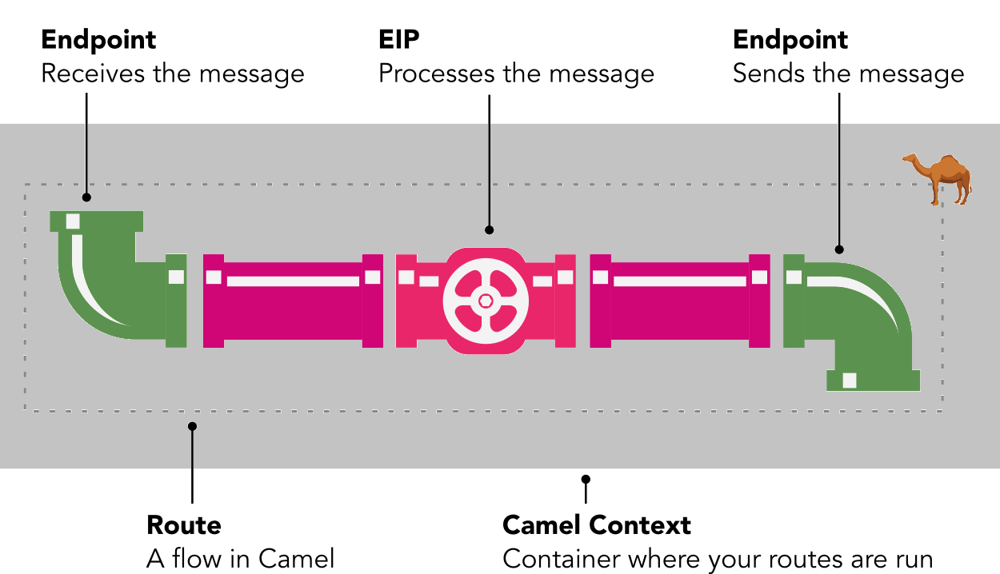
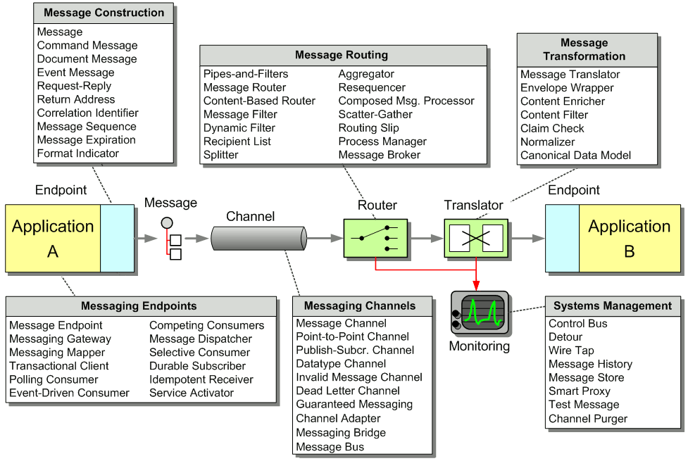

# Camel入门

[TOC]

## 1.背景

​    在介绍camel技术细节前，先说一下camel的现状。百度`Apache Camel`关键字，你能得到的除了官方网站外，几乎只有各种关于Camel的概况介绍——内容无非是Camel是什么，怎么从零搭建Camel。这些内容看起来很正常也很有用，但是实际上手后你就会发现完全不是那么回事——Camel本体就像一个底座，它能正常工作还要依赖于具体的组件，只介绍底座不介绍具体组件是很难开展开发工作的。Camel的社区目前比较差，能够参考的示例几乎都来自官网，这些示例都停在`Hello world`层面。你稍后就能看到，缺少了具体组件的详细介绍，开发工作会有多举步维艰。

​    完成了心理建设我们再正式开始介绍Camel项目本身。Camel全称是`Apache Camel`，是阿帕奇基金会旗下的一个开源框架。由于Camel社区不够活跃，成系统的资料就如同 `tan (π/2)`——不存在。因此请将[Camel官网](https://camel.apache.org/)当做你的唯一指定参考资料。特别提示，该网站为全英文且不太稳定，曾经出现过连续几天无法查看的情况，请珍惜有它的日子。以下介绍翻译自官网简介：

```
Apache Camel是一个基于企业集成模式(Enterprise Intergration Patterns, EIPs)的多功能开源整合框架。
Camel可让你使用领域特定语言Domain Specified Language,DSL(例如java xml groovy Kotlin YAML)来定义路由和调整规则。这意味着你可以在你的IDE中智能地完成(smart completion)路由规则，无论是java还是xml编辑器。
Apache Camel使用URIs来直接与任何传输或者消息模型（例如HTTP,Kafka,JMS,JBI,SCA,MINA或CXF）工作，并且提供可插拔组件和数据格式选项。Apache Camel是一个只用最小依赖以完成嵌入任何java应用工作的小库(small library)。它让你能够无视传输组件种类，总以相同的API完成开发，只要学习一次API你就能使用各种开箱即用(out-of-box)组件。
```

​    就像上面提到的，它从业务上讲有点类似于Spring Cloud Gateway。匹配上路由规则的请求可以沿着提前设定好的路径进行处理，最后完成转发。但它又有所不同，从功能上讲，它比Spring Cloud Gateway强大得多，它可以完成“胶水”功能。Spring Cloud Gateway几乎只被用来处理请求——http系请求或者到传输层请求。camel除了这些常规请求，还提供组件兼容各种**协议**与**中间件**。是的你没有看错，协议与中间件。比如你可以接收一个Kafka消息，然后把它转换成一个https请求转发出去。或者接收SFTP消息然后转发到一个数据库处理逻辑。接收消息只需要完成与目标组件相关的必需配置，和你自己的路由规则编写，剩下的交给camel。

​    你现在说一个协议或者中间件（统称为组件, Component），在你说完之前，我就可以告诉你Camel它支持！这也是学习它的困难的根源。官网只有这些组件的一个`Hello World`级别的示例，这是远远不够的。何况还有许多用户、公司或者开源组织自定义的组件。

##  2. Camel抽象模型

[本节参考资料](https://tomd.xyz/camel-tutorial/)

​    先来看看Camel的抽象模型：



**Route**

​    Camel中最基本的概念就是路由。路由指用户在Camel中配置的、将数据从一处流转到另一处的对象。流转的两个端点被称作`endpoints`。

​    你可以在camel中使用java语法或者xml语法来建立路由。以下给出了一个示例展示将文件从一个文件夹移动到另一个。

```java
from("file:home/customers/new").to("file:home/cutomers/old");
```

**Endpoints**

​    在Camel中，`endpoint`(本文译为`端点`)是一个接口。通过它，Camel可以在不同系统间交换`message`。Camel可以从一个端点接收`message`，或者发送一个`message`到一个端点。端点是路由路径上的步骤。你可以用不同的方式声明它们，但是最常用的方式是使用类似于URL风格的格式，例如：

```
prefix:mainpart?option1=xxx&option2=yyy
```

其中`prefix`表明端点的组件，`mainpart`是端点需要的一些配置。例如，路由的从一个端点接收消息，如果端点是`file:/myfolder`，那么Camel将使用文件组件并从`/myfolder`路径下读取文件。

**Components**

​    Camel附带的`Component`(`组件`)库允许它创建一个端点。组件像一个插头，允许你同一个外部系统连接，例如硬盘上的文件、邮箱或者一个像垃圾回收站或者twitter一样的应用(`app`)。

​    你可以把组件看做是一个生产端点的工程。在任何时间想把数据输入一个应用或者从应用中取出，你大概率都能在Camel的组件中找到一个现成的组件来满足你的使用需求。这意味着你不需要来那个费时间去写代码去完成读取文件或者调用一个web服务的代码。你只需要找到对应的组件然后使用就行了。

​    Camel组件是可复用且开源的，你也可以贡献你自己的组件。以下列出了部分常用组件并展示了该如何在端点中引用它们：

|    组件    | 作用                    | 端点URI     |
| :--------: | ----------------------- | ----------- |
|    HTTP    | 穿件或者消费一个web页面 | http:       |
|    File    | 读写文件                | file:       |
|    JMS     | 读写JMS消息队列         | jms:        |
|   Direct   | 组合你自己的Camel路由   | direct:     |
| Salesforce | 从Salesforce中存取数据  | salesforce: |

所有的官方组件列表请看官网：[Camel Components](https://camel.apache.org/components/3.20.x/index.html).

**Enterprise Integration Patterns (EIPs)**

​    `EIPs`是Camel中另一个重点。它们根据`《Enterprise Integration Patterns》`书中定义的模式，对消息进行特殊处理。

​    当你相对消息进行例如转换`transformation`、分拆`splitting`和记录日志`logging`等常用行为时，你就会使用到EIP。以下是Camel中常用的EIPs：

|  EIP名称   |           作用           |   java语法   |
| :--------: | :----------------------: | :----------: |
|  Splitter  |   将一个消息拆分成多个   |   .split()   |
| Aggregator |   将多个消息合并成一个   | .aggregate() |
|    Log     |  记录一行简单的日志消息  |    .log()    |
|  Marshal   | 将对象转换成文本或二进制 |  .marshal()  |
|    From    |      从端点接收消息      |   .from()    |
|     To     |      向端点发送消息      |    .to()     |

**Camel Context**

​    最后，为了能够运行、管理你的路由，Camel准备了一个叫做`Camel Context(Camel上下文)`的容器。你的路由在这个引擎中运行，你可以将他看成一个小型的应用服务。当Camel开始运行，它会读取你的路由定义（java或者xml语法），创建路由，并把他们加到Camel Context中，然后运行Camel Context。当停止运行时，Camel会关闭你的路由和Camel Context。

## 3. DSL

​    了解了抽象模型，再来看看具体的东西。Java DSL可以简单理解成对抽象模型的java实现。参看下图



​    上图基本上展示了Camel在java中的所有功能，按照阶段分成不同部分。接下来我们将通过几个实例来展示Java DSL如何使用：

**1、使用direct中转请求**

```java
from("netty-http:http://localhost:8080/camel/blank").to("direct:one");
from("direct:one").to("http://localhost:9090/camel/result?bridgeEndpoint=true");
```

​    `direct:one`是一个“虚空”组件，找遍整个应用你都找不到camel的作者和应用的开发者定义的那个“具体”的名为‘one’的类或对象。它只是一个标记。这两行的作用实际上等价于以下代码：

```java
from("netty-http:http://localhost:8080/camel/blank").to("http://localhost:9090/camel/result");
```

​    这个demo展示了以下信息：    

- `direct`的作用——以一种优雅的方式为同一个`from`设置分路。`to()`就是要将路由转发到的目的地。
- `from`和`to`并不禁止重复。
- `from`的监听坐标仅与`URI`有关系，与请求方法的类型（GET / POST）无关，这与SpringCloudGateway不同。
- `bridgeEndpoint=true`表示'复制输入端点的信息到输出端点，而不是创建新的消息'。否则在第二行代码中，终末端点将会收到“空消息”。

**2、过滤与处理**

```java
from("netty-http:http://localhost:8080/camel/filter")
                .routeId("ComplicatedRouter")
                .filter(exchange -> ((NettyHttpMessage) exchange.getMessage()).getHttpRequest().method().equals(HttpMethod.POST))
                //此处使用构造器构造processor，需要注意成员bean注入的问题
                //.process(new DemoProcessor())
                //此处直接使用beanName
                .process("demoProcessor")
                .to("http://localhost:9090/camel/result?bridgeEndpoint=true");
```

​    `routeId`用于给该路由命名，该信息可以从exchange和上下文中获取。
​    `filter`中使用了`Predicate`来过滤请求。这里的过滤条件是：只允许Post类型的请求通过。
​    `process`一共展示了两种指定对象的方法：其一是直接指定对象，不过并不建议这样做，否则复杂的注入逻辑都要手动处理。其二就是直接写对应的处理类在Spring容器中的名称，也就是`beanName`。不过请确保该对象已经被spring容器管理。

​    对于这里的`.process()`方法的输入对象，需要实现`org.apache.camel.Processor`接口，它仅有一个方法，如下所示：

```java
package org.apache.camel;

@FunctionalInterface
public interface Processor {

    void process(Exchange exchange) throws Exception;
}

```

**3.条件判断**

```java
//3.路径中含有choice条件判断
from("netty-http:http://localhost:8080/camel/choice")
         .routeId("ConditionalWithChoiceRouter")
         .choice()
         //验证HttpMethod
         .when(exchange -> ((NettyHttpMessage) exchange.getMessage()).getHttpRequest().method().equals(HttpMethod.POST))
         .to("http://localhost:9090/camel/query?bridgeEndpoint=true")
         .otherwise().to("http://localhost:9090/camel/get?bridgeEndpoint=true")
         .endChoice().end();
```

​    在这个例子中，我们使用`when()`方法判断HTTP请求的类型，结果为`TRUE`则会进入`when()`之后的分支，结果为`FALSE`则会进入`otherwise()`后的分支。

**4.异常处理**

​    异常处理的方式包括两种，先说明第一种：

```java
from("netty-http:http://localhost:8080/camel/exception")
        .routeId("ConditionalWithBeanRouter")
        .unmarshal()
        .json(JsonLibrary.Fastjson, RequestModel.class)
        .doTry()
        //这里的bean方法相当于一个Processor，需要遵循Processor的使用规范
        .bean(ConditionalBean.class)
        .doCatch(RuntimeException.class)
        .process("exceptionProcessor")
        .end()
        .end()
        .marshal().json(JsonLibrary.Fastjson)
        .to("http://localhost:9090/camel/exception?bridgeEndpoint=true");
```

`unmarshal()`表示将原始的Json字符串解析成Java对象，之后才能在camel的`doTry`和`doCatch`中捕获到解析后的对象。

`json()`指明了所用序列化引擎与目标对象。

`doTry()`表示开始一个try逻辑

`bean()`中指定了一个Bean的类型，Camel会自动调用存放在Spring容器内的同类型的对象。这个bean需要一个使用了`@org.apache.camel.Handler`注解的方法，之后系统会自动调用该方法。`bean()`还有一个重载方法能更直观展示运行模式`bean(Class<?> beanType, String method)`即运行`beanType`类的实例的`method`方法。

`doCatch()`中指定想要捕获的异常的类型。

`process()`是`try-catch`之后的处理方法。

`end()`出现了两次，第一次匹配的是`doCatch()`，第二次是匹配`doTry()`。该方法本身只是终结标志，不具有业务上的功能。这一段代码等价于：

```java
try{
    //handler()实际为带有@Handler注解的方法，方法名可任意命名
    conditionalBean.handler(exchange);
} catch (RuntimeExcption ex){
    //异常信息可以直接从exchange对象中获取
    exceptionProcessor.process(exchange);
}
```

`.marshal().json(JsonLibrary.Fastjson)` 为`unmarshal`的逆操作。这里必须转换回Json，因为前面的`unmarshal`转换相当于直接将报文从String替换成了格式化对象，而http传输的报文体实际上就是JSON格式的String，因此需要转换回String。

`to()`表示需要转发后的终端。

**5.异常处理的另一种方式**

这里仅说明相异的部分

```java
from("netty-http:http://localhost:8080/camel/exception")
        .routeId("ConditionalWithBeanRouter")
        .unmarshal()
        .json(JsonLibrary.Fastjson, RequestModel.class)
        .bean(ConditionalBean.class)
        .onException(RuntimeException.class)
        .handled(true)
        .to("bean:conditionalBean?method=handleException")
        .end()
        .marshal().json(JsonLibrary.Fastjson)
        .to("http://localhost:9090/camel/exception?bridgeEndpoint=true");
```

`onExceptopn()`紧跟在`bean()`方法之后，表示当`bean()`遭遇`RuntimeException`异常时，触发异常处理流程。

`handled(true)`表示当发生异常并进入onException流程后，如果handled被设置为true，那么最后的`to("http://localhost:9090/camel/exception?bridgeEndpoint=true")`就不会被执行，这与上一个示例不同，需要注意。

`to("bean:conditionalBean?method=handleException")`指定了conditionalBean对象的handleException方法来处理RuntimeException类型的异常。

这一段代码相当于：

```java
try{
    //handler()实际为带有@Handler注解的方法，方法名可任意命名
    conditionalBean.handler(exchange);
} catch(RuntimeException ex){
    conditionalBean.handleException(ex);
}
```

